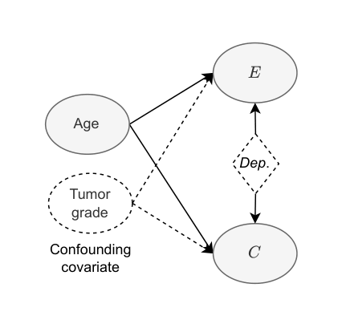
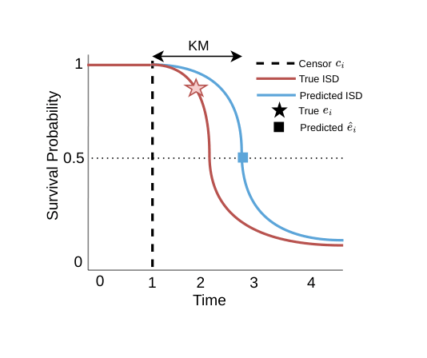
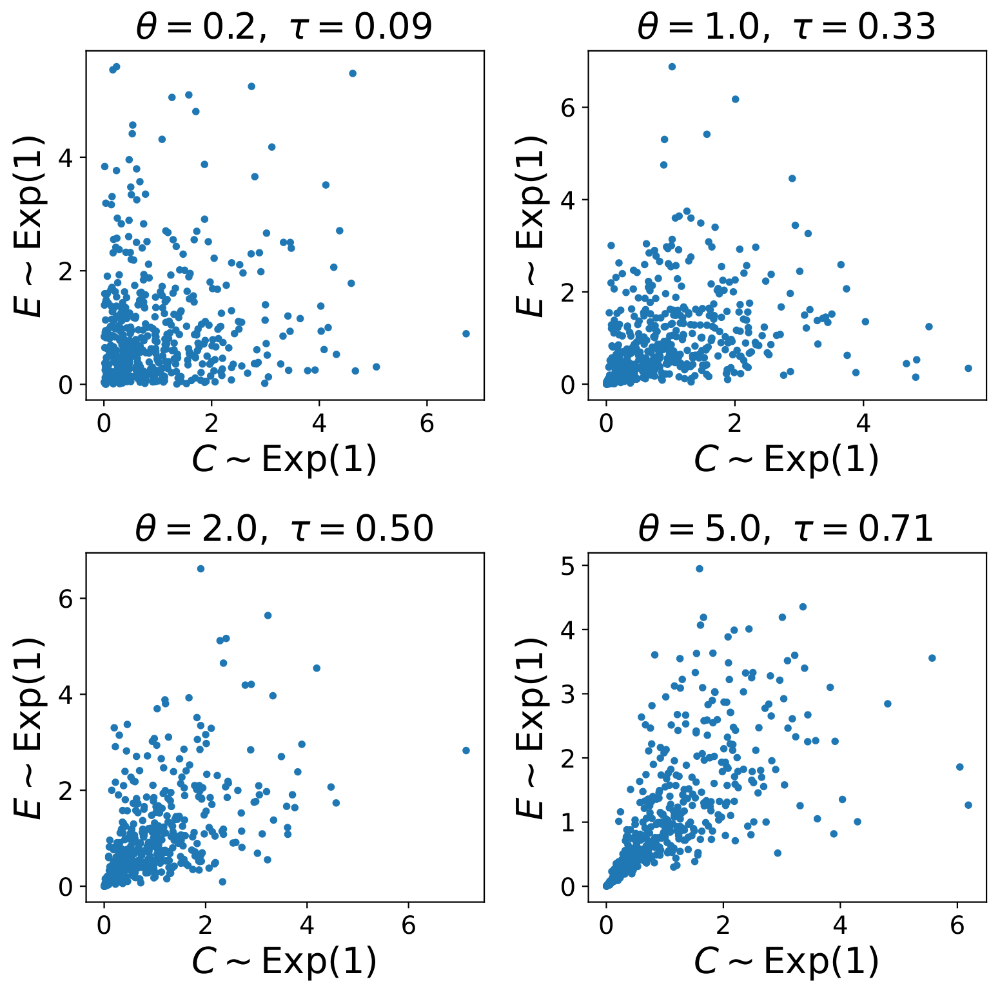

# DependentEVAL


Code for "Overcoming Dependent Censoring in the Evaluation of Survival Models (2026)"

Preprint: https://arxiv.org/abs/2502.19460

**Accepted to UAI 2026**

This repository accompanies our introduction of the **dependent Brier score and integrated dependent Brier score (IBS-Dep)**, a survival-model evaluation metric designed for settings with dependent censoring. The method models the joint distribution of event and censoring times and uses the Copula-Graphic estimator to impute marginal event times for censored instances. The repository contains the implementation and experiments supporting our theoretical analysis of the CG-based margin-time estimator and our semi-synthetic evaluation of how well IBS-Dep approximates the oracle IBS based on uncensored event times.

## What is dependent censoring anyway?

In survival analysis, we are interested in the time until an event occurs. The event might be cancer relapse, disease progression, equipment failure, or something else entirely. The problem is that we do not always get to observe that event. A patient may leave the study, be lost to follow-up, or reach the end of the observation period before the event occurs. This is called **censoring**.

Let

- $E$ denote the event time,
- $C$ denote the censoring time, and
- $X$ denote the observed covariates.

For each individual, we observe only

$$
T = \min(E,C),
\qquad
\Delta = \mathbb{1}[E \leq C].
$$

In other words, we observe whichever happens first: the event or censoring. The indicator $\Delta$ tells us which one we observed.
Most survival methods assume **conditional independent censoring**:

$$
E \perp C \mid X.
$$

Informally, this says that after accounting for the observed covariates $$X$$, knowing when an individual is censored should tell us nothing more about when their event would have occurred.
Censoring is dependent when this assumption does not hold:
$$
E \not\perp C \mid X.
$$

This is not an unusual situation. For example, suppose that tumor grade affects both cancer relapse and the probability of dropping out of a study. If tumor grade is not observed, then relapse and dropout may remain dependent even after conditioning on all available covariates.

<table>
  <tr>
    <td align="center" width="30%">
      
    </td>
    <td align="center" width="36%">
      
    </td>
    <td align="center" width="34%">
      
    </td>
  </tr>
  <tr>
    <td valign="top">
      <b>(a) Unobserved confounding.</b><br>
      An unobserved covariate, such as tumor grade, affects both the event and censoring processes and creates residual dependence between them.
    </td>
    <td valign="top">
      <b>(b) Why this matters.</b><br>
      A patient is censored shortly before an event for reasons related to their event risk. The true and Kaplan–Meier survival curves agree up to the censoring time but diverge afterward.
    </td>
    <td valign="top">
      <b>(c) Modeling the dependence.</b><br>
      Event and censoring times are generated using a Clayton copula. Larger Kendall's \(\tau\) corresponds to stronger dependence.
    </td>
  </tr>
</table>

Why is this a problem for evaluation? Standard estimators generally treat censored individuals as being comparable to those who remain under observation, after accounting for the available covariates. Under dependent censoring, that may be wrong.

A patient who drops out because their health is deteriorating is not necessarily comparable to a patient who remains in the study. Kaplan–Meier and inverse-probability-of-censoring weighted estimators may therefore assign inappropriate survival probabilities or censoring weights.

The result is that an evaluation metric can report a distorted prediction error rather than the error we would have obtained if every event time had been observed. A survival model may consequently appear better or worse simply because the evaluation method does not account for the dependence between event and censoring times.

---

## Can we identify dependent censoring from the data?

Unfortunately, not without additional assumptions.

For each individual, we observe either the event time or the censoring time, but not both. If a patient is censored, we do not know when their event would eventually have occurred. Likewise, if the event occurs first, we do not observe their latent censoring time.

This means that the joint distribution of $$E$$ and $$C\$$, and therefore their dependence structure, is generally not identifiable from ordinary right-censored data alone. There is no simple statistical test that can tell us, without further assumptions, whether censoring is independent or dependent.

In practice, dependent censoring can instead be investigated using:

1. **Domain knowledge:** Could dropout, loss to follow-up, or study termination be related to disease severity or event risk?
2. **Observed predictors of censoring:** Are some measured variables associated with both censoring and the outcome?
3. **Sensitivity analysis:** Do the conclusions change across plausible copula families or dependence strengths?
4. **Joint modeling assumptions:** Does a specified copula model provide a reasonable description of the latent event and censoring processes?

The goal is therefore not to "discover" the true dependence structure from the observed data alone. Instead, we make the dependence assumptions explicit, estimate what can be estimated under those assumptions, and examine whether the conclusions are robust to other plausible choices.

Any fitted copula parameter should consequently be interpreted as model-dependent rather than as assumption-free evidence that censoring is dependent.

---

## Fitting a copula model

The repository includes an experiment for fitting and comparing candidate copula models:

```bash
python src/experiments/find_copula.py --help
```

See [`src/experiments/find_copula.py`](src/experiments/find_copula.py).

The script can be used to:

- fit the supported copula families,
- estimate their dependence parameters,
- compare candidate dependence models,
- report the corresponding Kendall's $\tau$, and
- perform sensitivity analyses under alternative dependence assumptions.

The basic idea is to model the event and censoring times jointly rather than treating them as unrelated processes. Their joint survival distribution is written as
$S_{E,C}(e,c \mid X) =
C_\theta\!\left(
S_E(e\mid X),
S_C(c\mid X)
\right),$
where $$S_E$$ and $$S_C$$ are the marginal survival distributions and $$C_\theta$$ is a copula with dependence parameter $$\theta$$.
The copula connects the two marginal distributions while controlling how strongly the latent event and censoring times depend on one another.
For an Archimedean copula,
$C_\theta(u_1,u_2) =
\varphi_\theta^{-1}
\left(
\varphi_\theta(u_1)+\varphi_\theta(u_2)
\right),
$
where $$\varphi_\theta$$ is the copula generator. Different copula families represent different kinds of dependence. For example, some place more emphasis on dependence among particularly short event and censoring times, while others describe dependence more symmetrically. Copula selection should therefore be based not only on empirical fit but also on what kinds of dependence are scientifically plausible in the application. Because the true copula is not identifiable from ordinary right-censored data, we recommend comparing several plausible specifications rather than treating one fitted family as unquestionable ground truth.

---

## What does this repository implement?

The main contribution of the paper is the **dependent Brier score** and its integrated version, **IBS-Dep**, for evaluating survival models under dependent censoring.

IBS-Dep models the joint distribution of event and censoring times and uses the Copula-Graphic estimator to estimate the marginal event-time distribution. For censored individuals, this distribution is used to construct a margin-time surrogate for the unobserved event time.

The repository contains implementations of:

- the dependent Brier score and integrated dependent Brier score,
- copula-based joint modeling of event and censoring times,
- the Copula-Graphic estimator,
- CG-based margin-time estimation,
- Kaplan–Meier and IPCW comparison methods,
- copula fitting and parameter estimation,
- synthetic experiments with controlled dependence and censoring, and
- semi-synthetic experiments using covariates from real survival datasets.

Reusable implementations are located in [`src/`](src/).

Experiment entry points are provided in [`scripts/`](scripts/) and [`src/experiments/`](src/experiments/).

The analysis and figure-generation code is available in [`notebooks/`](notebooks/).

---

## How do I use the metric?

`DependentEvaluator` computes a dependent-censoring-aware Integrated Brier Score (IBS).  

```python
from src.evaluator import DependentEvaluator  # adjust import path if needed

# survival_outputs: array of predicted survival curves, shape (n_test, n_time_bins)
# time_coordinates: array of time coordinates for the survival curves, shape (n_time_bins,)
# test_event_times / test_event_indicators: test event times and indicators
# train_event_times / train_event_indicators: train event times and indicators
# copula_name: copula family name (eg, "clayton")
# alpha: dependence parameter (eg, 2.0)
dep_evaluator = DependentEvaluator(
    predicted_survival_curves=survival_outputs,
    time_coordinates=time_bins,
    test_event_times=test_times,
    test_event_indicators=test_events,
    train_event_times=train_times,
    train_event_indicators=train_events,
    copula_name=copula_name,
    alpha=alpha,
)

# Dependent IBS (BG, no uncertainty weighting)
ibs_dep_bg = dep_evaluator.integrated_brier_score(num_points=10, uncertainty_weighting=False)
print("Dependent IBS (BG):", ibs_dep_bg)

# Dependent IBS (BG with uncertainty weighting; default)
ibs_dep_bg_uw = dep_evaluator.integrated_brier_score(num_points=10, uncertainty_weighting=True)
print("Dependent IBS (BG+UW):", ibs_dep_bg_uw)
```
num_points controls the number of evaluation time points used for numerical integration. <br>
uncertainty_weighting=True applies additional down-/up-weighting of imputed censored observations.

Citation
--------
If you find this paper useful in your work, please consider citing it:
 
```
@article{lillelund_overcoming_2025,
  title={Overcoming Dependent Censoring in the Evaluation of Survival Models}, 
  author={Christian Marius Lillelund and Shi-ang Qi and Russell Greiner},
  journal={preprint, arXiv:2502.19460},
  year={2025},
}
```
